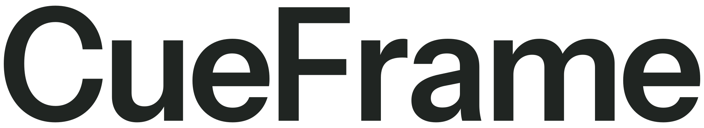
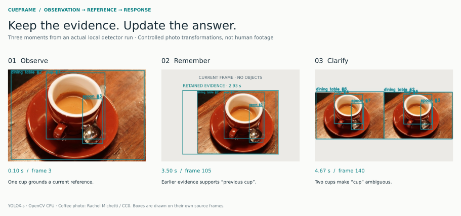
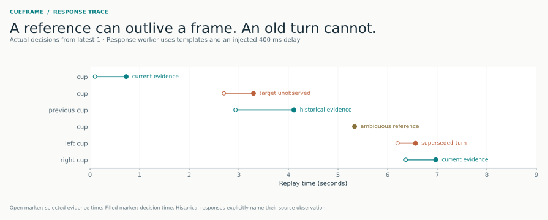
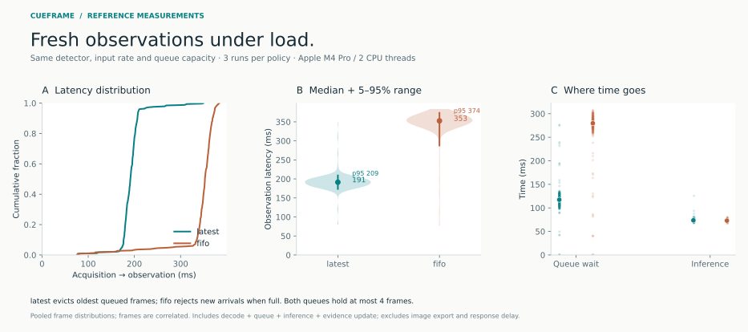

<div align="left">
<h1><picture><source media="(prefers-color-scheme: dark)" srcset="docs/assets/wordmark-light.svg"></picture></h1>
<p><strong>Visual evidence for real-time human–AI interaction.</strong></p>
<p>A C++ runtime that connects current observations and retained history to a response — and checks whether that response still belongs.</p>
<p><a href="https://mingkai406.github.io/cueframe/">Interactive project page</a> · <a href="#quick-start">Run locally</a> · <a href="docs/architecture.md">Architecture</a></p>

</div>



Someone shows an object, moves it, then says “the previous one.” An interactive system needs both a current view and a memory of what the person could be referring to. CueFrame makes that boundary explicit: observations carry timestamps, references select evidence, and pending responses are rechecked before publication.

**v0.1 is a working engineering prototype:** local YOLOX-s inference, bounded C++ concurrency, object association, finite reference commands, cancellable pending responses, trace replay, and reproducible measurements.

## What runs today

- **Real model inference.** OpenCV DNN executes a checksum-pinned YOLOX-s ONNX model on CPU, with letterboxing, grid/stride decoding, class-aware NMS, and source-coordinate recovery.
- **Bounded streaming.** Capture and inference run independently. Compare oldest-frame eviction with bounded FIFO admission at the same queue capacity.
- **Temporal references.** Select a visible class, the left/right instance, a normalized image point, or a previous retained observation. Ambiguity produces clarification.
- **Response checks.** Suppress pending answers after a new turn, source reset, target change, loss of observation, or evidence expiry. Historical references keep their own evidence timestamp.
- **Inspectable output.** Every run saves model timings, queue statistics, object snapshots, response decisions, and detection overlays on the exact inferred frame.

The response renderer uses templates and a configurable injected delay. It is not a language model. The publication contract operates on observed state; it cannot detect changes the camera/model has not yet observed.

## Quick start

Requires a C++20 compiler, Python 3.10+, CMake 3.24+, and OpenCV 4.8+ with DNN. Tested locally with AppleClang 21, OpenCV 4.12.0, and Apple M4 Pro. CI tests the dependency-free core on Linux/macOS and real-model inference on Linux.

```bash
python3 -m venv .venv
source .venv/bin/activate
pip install -r requirements-dev.txt

# Download the verified model and build a minimal project-local OpenCV.
python scripts/bootstrap.py --opencv
cmake -S . -B build -DCMAKE_BUILD_TYPE=Release \
  -DCMAKE_PREFIX_PATH="$PWD/.deps/opencv-install"
cmake --build build -j 4
ctest --test-dir build --output-on-failure

# Actual inference, no camera or API key needed.
./build/cueframe_run --input examples/coffee.png \
  --frames 30 --out runs/demo
```

If OpenCV 4.8+ is already installed, run `python scripts/bootstrap.py` without `--opencv`, and point CMake at that installation. The minimal source build disables FFmpeg/GStreamer; image directories are portable, while video-file support depends on installed backends. macOS builds can use AVFoundation. Use an OpenCV build with the appropriate backend for your video format.

### Reproduce the visual interaction trace

```bash
python scripts/make_fixture.py
./build/cueframe_run --input runs/fixture --fps 30 --frames 240 \
  --queries examples/queries.tsv --response-delay-ms 400 \
  --policy latest --capacity 4 --out runs/replay
```

This eight-second fixture applies controlled transformations to a CC0 photograph. It tests motion, a blank scene, duplicate objects, and restoration; it is not a human-interaction recording. Scheduled queries trigger on the first processed observation at or after their timestamp.

```text
cup               select a unique currently observed cup
left cup          select the leftmost currently observed cup
right cup         select the rightmost currently observed cup
at 0.4 0.3        select the unique box containing a normalized image point
previous cup      use the newest older retained snapshot containing a cup
```

The observed trace includes a published current answer, suppression after the target is no longer observed, a published historical answer, clarification with two cups, and suppression of a superseded turn.



### Try a camera

```bash
./build/cueframe_run --camera 0 --interactive --frames 900 \
  --fps 15 --out runs/camera
```

Grant OS camera access if prompted, then type reference commands in the terminal. `/quit` stops the run. Input ends after the frame limit; if the terminal is waiting for a line, press Enter to finish. The first-release camera path is implemented but **not hardware-verified in this session**. Local recordings and run outputs are ignored by Git.

## Reference measurements



| Equal-capacity policy | Processed frames across 3 runs | Median observation latency | p95 observation latency |
|---|---:|---:|---:|
| Latest: evict oldest waiting frame | 331 | 191.3 ms | 209.1 ms |
| FIFO: reject new arrivals when full | 334 | 352.7 ms | 373.6 ms |

**Conditions:** Apple M4 Pro, CPU only, YOLOX-s FP32, OpenCV 4.12.0, two inference threads, 30 input fps, four queue slots, 240 source frames per run, three runs per policy. Order alternates between policies. Median detector inference was about 73 ms for both policies. Peak process RSS ranged from 343–347 MiB across the six runs.

Latency is acquisition-to-evidence-update, including decode and queue wait, excluding JPEG export and response delay. Warm-up is excluded and recorded separately. Dropped frames are an explicit tradeoff; the latest policy does not make the detector faster or prove better interaction accuracy. Frame samples are correlated. These results are a reference measurement, not a general performance guarantee.

[Raw CSV/JSONL and environment](results/reference/) · [Measurement definitions](docs/architecture.md#trace-contract)

```bash
python scripts/benchmark.py --out runs/benchmark-final
python scripts/report.py --runs runs/benchmark-final
python -m http.server 8000 --directory docs
```

The report regenerates three original figures and an interactive replay from actual run artifacts. Plot design draws on distribution-first and annotated multi-panel examples in the [ggplot2 extensions gallery](https://exts.ggplot2.tidyverse.org/gallery/); rendering uses Matplotlib. No generated stock illustrations or invented results.

## Design and verification

```text
Camera / replay ── bounded frame queue ── YOLOX owner
                                               │
                                    timestamped observations
                                               │
                               tracks + bounded snapshot history
                                               │
Reference query ── evidence ticket ── response worker ── commit check
                                                         │
                                            publish / clarify / suppress
```

The core has **18 executable contract tests**, including overload, concurrent queue ordering, shutdown, ambiguity, cumulative target movement, unrelated object changes, turn replacement, source reset, expiry, and history eviction. Real-model tests verify actual detections, landscape/portrait coordinate recovery, and empty-input rejection. AddressSanitizer and UndefinedBehaviorSanitizer cover the core in CI.

```bash
cmake -S . -B build-core -DCUEFRAME_VISION=OFF \
  -DCUEFRAME_SANITIZE=ON -DCMAKE_BUILD_TYPE=Debug
cmake --build build-core -j 4
ctest --test-dir build-core --output-on-failure
```

Object association is a conservative same-class IoU heuristic, not robust re-identification. History is bounded to 96 observations, not a fixed duration. See [architecture and limits](docs/architecture.md).

## License

MIT for CueFrame code. Model and dependencies retain their own licenses; see [NOTICE](NOTICE). Coffee photograph: Rachel Michetti, CC0, via scikit-image.
